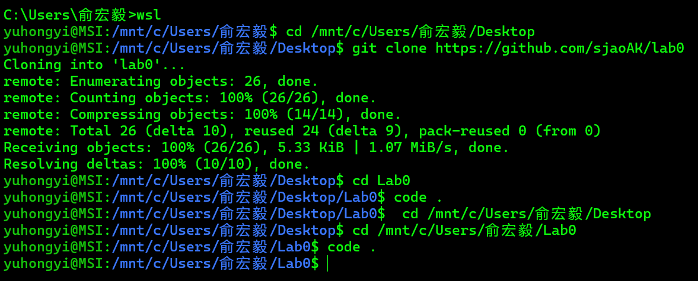
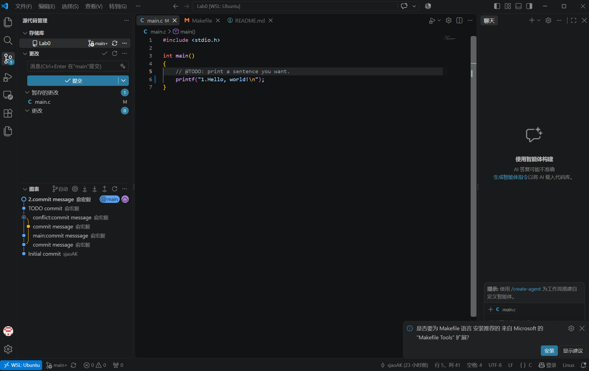
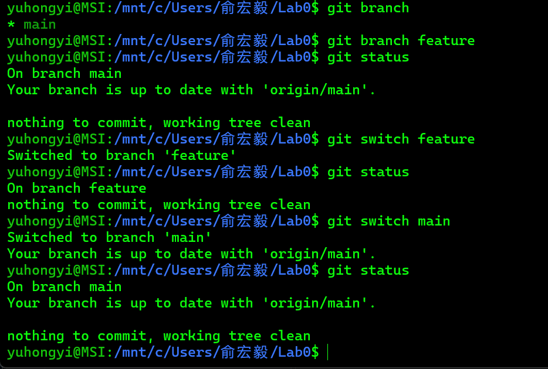
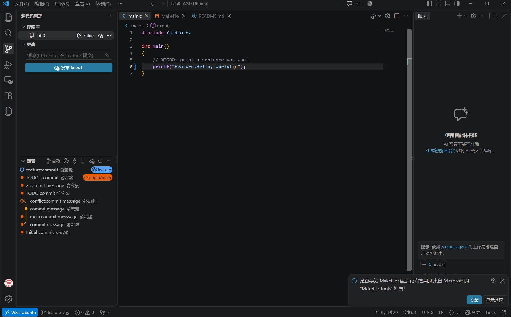
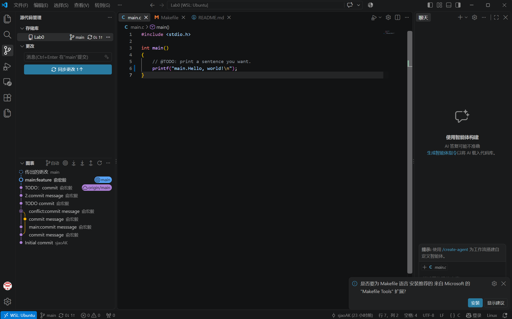
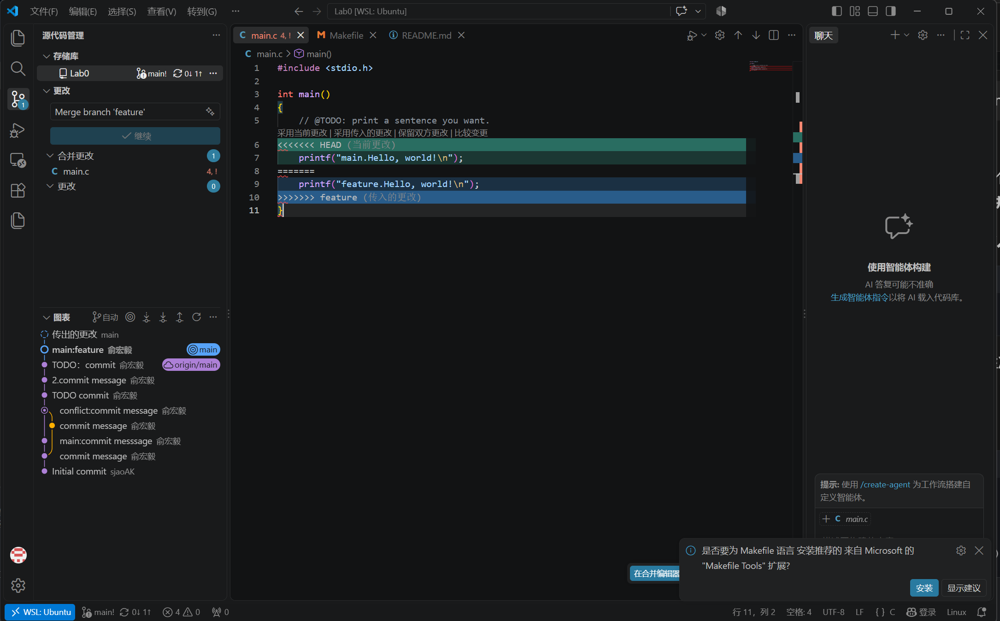
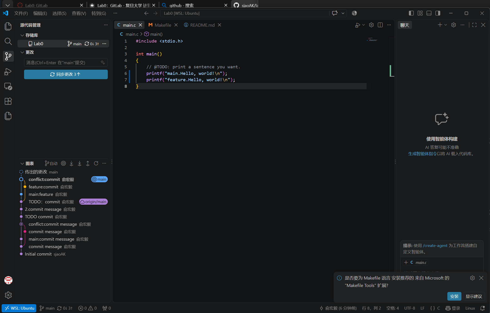

1.  
    - 之前没有多人协同开发的经历。我只在前面的学期做过小组人工智能模型搭建的作业，当时我们每人负责一部分代码，每次修改自己负责的部分后把完整的代码上传到微信群。  
    - 设计“暂存-提交”是因为并不是每次改动都想提交，暂存可以选择一部分改动，再提交时就是把这部分改动存入仓库了。  
    - git branch只列出本地分支，而git branch -a会列出所有分支，包括远程仓库的分支。  
2.  
    - 实验过程：修改main.c并保存，暂存修改，然后提交，说明为“TODO:commit”。  
    -   
    -   
3.  
    - [Commit Message 规范]里面主要讲了不同的修改版本提交时的规范用语，来让大家都能看清谁做了什么修改。学习git能让团队工作更有序，不会因为没有上报个人的修改影响整个团队的工作。  
    - [语义化版本]讲了不同版本的编号方式及优先级原则。学习git让我们对一个软件的开发过程更了解，并能在需要时选择正确的版本。  
4.  
    - 实验过程：1.添加feature分支，在分支里做改动，提交说明“feature:commit” 2.回到main分支做出改动，提交说明“main:feature” 3.合并feature遇到冲突，删去vscode生成的冲突代码，提交说明“conflict:commit”。  
    -   
    -   
    -   
    -   
    -   
